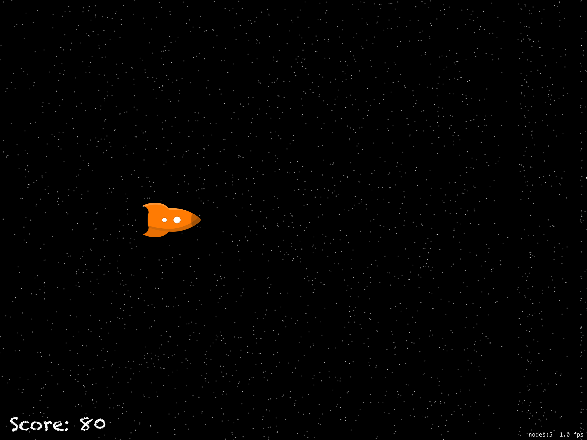
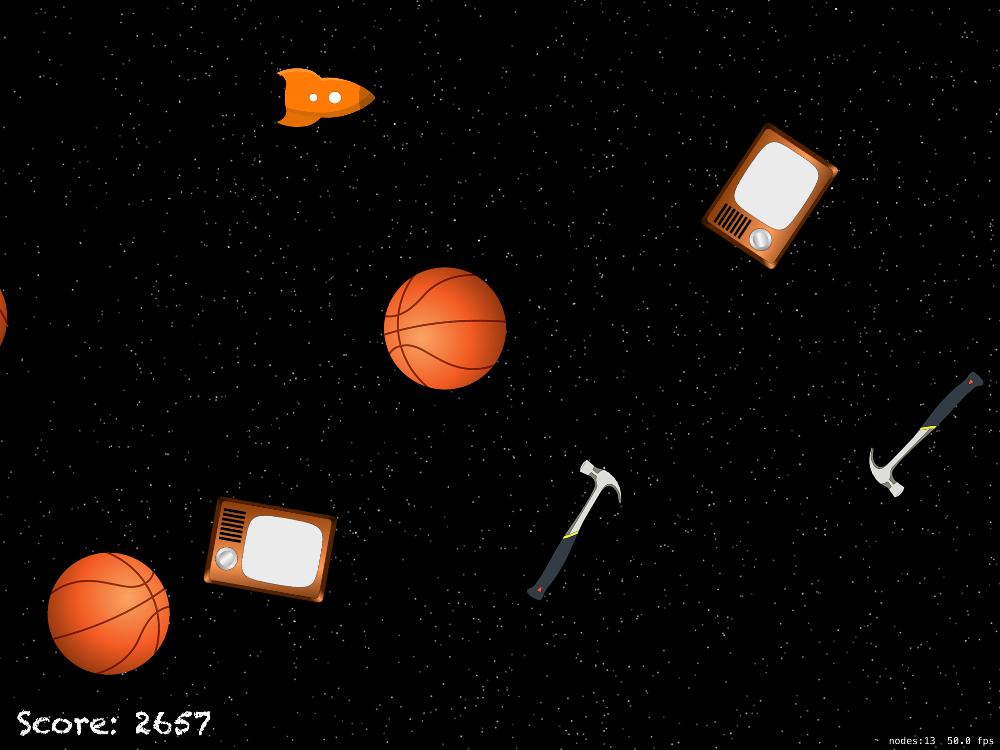
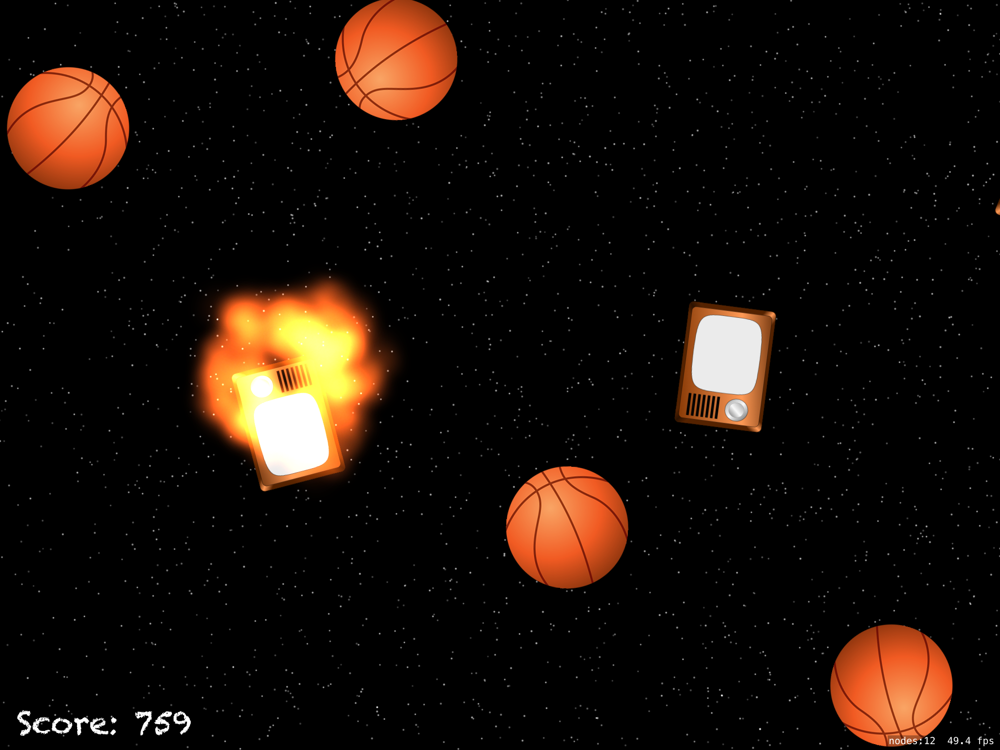

# SpaceRace
The game created for surviving 
## Tools implemented in project
- SpriteKit
- SKLabelNode
- SKPhysicsContactDelegate
- SKEmitterNode
- SKSpriteNode
- zRotation
- physicsBody
- advanceSimulationTime
- linearDamping
- removeFromParent
- angularDamping
- CGVector
- update
 ## Project Screen Shots

 

## More features soon 
- fixing bag with teleporting
- label if wins
- new game button
- new enemies
- stopping enemy creation and stopping gravity after death
## Conclusion 
It was an interesting project which helped me to understand how works SpriteKit.
Even though it was a basic app, it was challenging for me and takes lots of efforts to finish.
I'm satisfied with the work I've done and will return to make this up even more beautiful.
