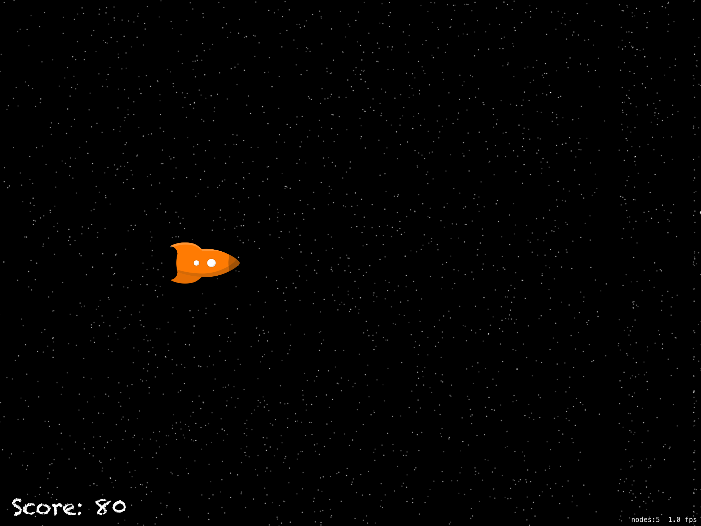
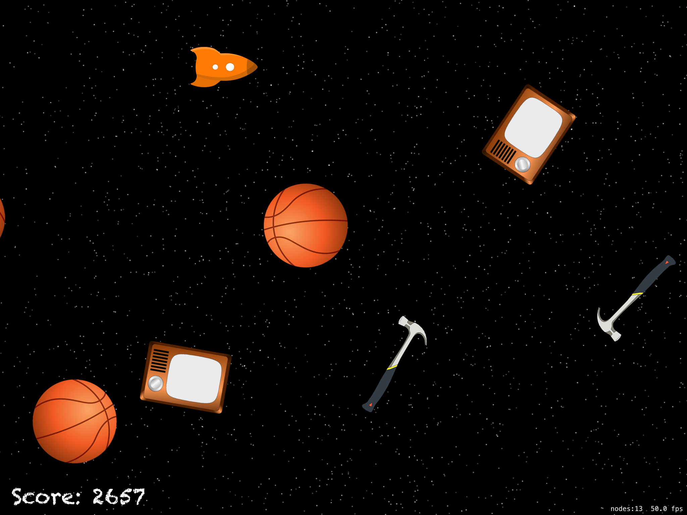
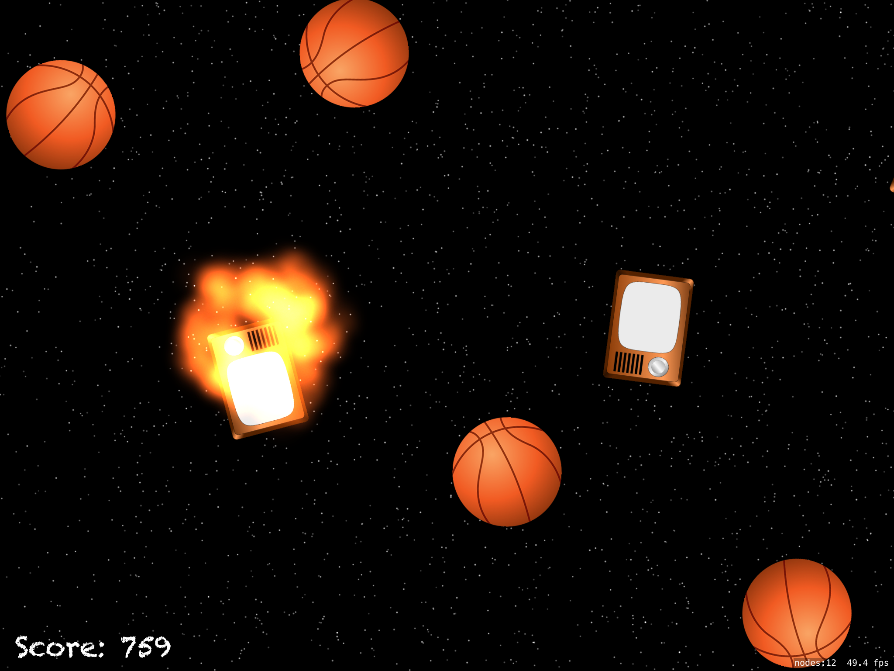

# SpaceRace
The game created for surviving 
## Tools implemented in project
- SpriteKit
- SKLabelNode
- SKPhysicsContactDelegate
- SKEmitterNode
- SKSpriteNode
- zRotation
- physicsBody
- advanceSimulationTime
- linearDamping
- removeFromParent
- angularDamping
- CGVector
- update
 ## Project Screen Shots

 

## More features soon 
- fixing bag with teleporting
- label if wins
- new game button
- new enemies
- stopping enemy creation and stopping gravity after death
